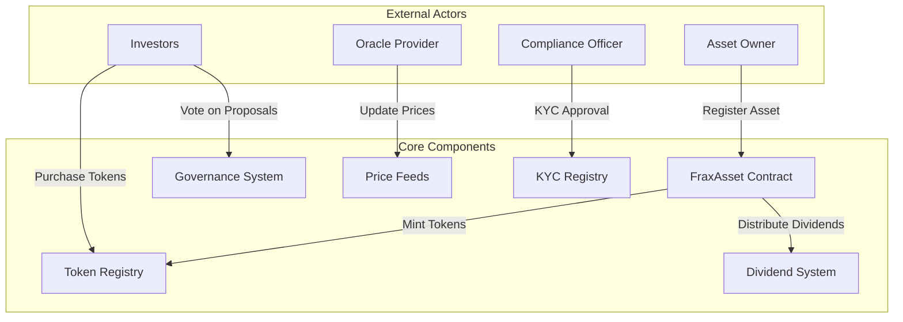

# FraxAsset Protocol

> Revolutionary Real-World Asset Tokenization Platform on Stacks

[](https://stacks.co)
[](https://clarity-lang.org)
[](https://bitcoin.org)

## Overview

FraxAsset empowers institutional and retail investors to unlock liquidity from traditionally illiquid assets through blockchain-native fractional ownership. Built on Bitcoin's security layer via Stacks, this protocol democratizes access to high-value assets while maintaining regulatory compliance and transparency.

The protocol represents a paradigm shift in asset management, bridging traditional finance with decentralized infrastructure. By leveraging Clarity's security guarantees and Bitcoin's settlement finality, we've created a robust ecosystem for tokenizing real estate, art, commodities, and other high-value assets.

## Key Features

### 🔐 **Dynamic Semi-Fungible Token Architecture**

- Precise ownership representation with fractional tokens
- 100,000 tokens per asset for granular ownership division
- Immutable ownership records secured by Bitcoin

### 🏛️ **Integrated KYC/AML Compliance Framework**

- Multi-tier compliance levels (0-5)
- Automated regulatory compliance tracking
- Institutional-grade compliance infrastructure

### 🗳️ **Sophisticated Governance Mechanisms**

- Democratic proposal system with quorum requirements
- Weighted voting based on token ownership
- Minimum 10% stake requirement for proposal creation

### 💰 **Automated Dividend Distribution**

- Transparent yield tracking and distribution
- Pro-rata dividend allocation based on ownership
- Claimable dividend system with historical tracking

### 📊 **Oracle-Powered Asset Valuation**

- Real-time asset price discovery
- Multi-oracle support for price reliability
- Decimal precision support for accurate valuations

### 🛡️ **Multi-Layered Security**

- Bitcoin-backed settlement guarantees
- Clarity's predictable execution model
- Comprehensive input validation framework

## System Architecture



## Contract Architecture

### Core Data Structures

#### Asset Registry

```clarity
(define-map assets
  { asset-id: uint }
  {
    owner: principal,
    metadata-uri: (string-ascii 256),
    asset-value: uint,
    is-locked: bool,
    creation-height: uint,
    last-price-update: uint,
    total-dividends: uint,
  }
)
```

#### Token Ownership Ledger

```clarity
(define-map token-balances
  {
    owner: principal,
    asset-id: uint,
  }
  { balance: uint }
)
```

#### Governance System

```clarity
(define-map proposals
  { proposal-id: uint }
  {
    title: (string-ascii 256),
    target-asset-id: uint,
    start-height: uint,
    end-height: uint,
    is-executed: bool,
    affirmative-votes: uint,
    negative-votes: uint,
    quorum-threshold: uint,
  }
)
```

## System Parameters

| Parameter | Value | Description |
|-----------|-------|-------------|
| `TOKENS-PER-ASSET` | 100,000 | Fractional tokens per registered asset |
| `MAX-ASSET-VALUE` | $1T | Maximum asset valuation limit |
| `MIN-ASSET-VALUE` | $1K | Minimum asset valuation threshold |
| `MAX-PROPOSAL-DURATION` | 144 blocks | ~24 hours maximum voting period |
| `MIN-PROPOSAL-DURATION` | 12 blocks | ~2 hours minimum voting period |
| `MAX-VALIDITY-PERIOD` | 52,560 blocks | ~365 days maximum validity |

## Data Flow

### Asset Tokenization Flow

```text
1. Asset Registration
   ├── Owner registers asset with metadata URI
   ├── Initial valuation set within bounds
   ├── 100,000 tokens minted to owner
   └── Asset becomes available for trading

2. Token Distribution
   ├── Owner transfers tokens to investors
   ├── Ownership tracked in token-balances map
   ├── KYC compliance verified for transfers
   └── Fractional ownership established
```

### Governance Flow

```text
1. Proposal Creation
   ├── Stakeholder creates proposal (10% minimum stake)
   ├── Voting period defined (12-144 blocks)
   ├── Quorum threshold set
   └── Proposal becomes active

2. Voting Process
   ├── Token holders cast weighted votes
   ├── Vote weight limited to token balance
   ├── Double voting prevented
   └── Results tallied automatically

3. Proposal Execution
   ├── Voting period ends
   ├── Quorum and majority checked
   ├── Proposal marked as executed
   └── Changes implemented
```

### Dividend Distribution Flow

```text
1. Dividend Declaration
   ├── Asset generates income
   ├── Total dividends updated in asset record
   ├── Pro-rata calculation based on ownership
   └── Dividends become claimable

2. Claim Process
   ├── Token holder claims available dividends
   ├── Claimable amount calculated from ownership
   ├── Claim record updated to prevent double-claiming
   └── Dividends distributed to holder
```

## Public Interface

### Core Functions

#### Asset Management

- `register-asset-for-tokenization` - Register new asset for tokenization
- `get-asset-details` - Retrieve comprehensive asset information
- `get-token-balance` - Query token holdings for any address

#### Governance

- `create-governance-proposal` - Create new governance proposal
- `cast-governance-vote` - Vote on active proposals
- `get-proposal-details` - Get proposal information and status

#### Dividend System

- `claim-available-dividends` - Claim accumulated dividends
- `get-previous-dividend-claim` - Check dividend claim history

#### Oracle Integration

- `get-price-feed-data` - Access real-time asset valuations

## Error Codes

| Code | Constant | Description |
|------|----------|-------------|
| 100 | `ERR-OWNER-ONLY` | Owner-only function access |
| 101 | `ERR-NOT-FOUND` | Asset or record not found |
| 102 | `ERR-ALREADY-EXISTS` | Duplicate entry attempted |
| 103 | `ERR-INVALID-AMOUNT` | Invalid amount specified |
| 104 | `ERR-NOT-AUTHORIZED` | Insufficient permissions |
| 105 | `ERR-KYC-REQUIRED` | KYC compliance required |
| 106 | `ERR-VOTE-EXISTS` | Vote already cast |
| 107 | `ERR-VOTING-ENDED` | Voting period expired |
| 108 | `ERR-ASSET-LOCKED` | Asset currently locked |

## Development Setup

### Prerequisites

- [Clarinet](https://github.com/hirosystems/clarinet) - Stacks development tool
- [Node.js](https://nodejs.org/) v16+ for testing framework
- [Git](https://git-scm.com/) for version control

### Installation

```bash
# Clone the repository
git clone https://github.com/ife-danielstyle/frax-asset.git
cd frax-asset

# Install dependencies
npm install

# Check contract syntax
clarinet check

# Run tests
npm test
```

### Project Structure

```text
frax-asset/
├── contracts/
│   └── frax-asset.clar          # Main protocol contract
├── tests/
│   └── frax-asset.test.ts       # Test suite
├── settings/
│   ├── Devnet.toml             # Development configuration
│   ├── Testnet.toml            # Testnet configuration
│   └── Mainnet.toml            # Production configuration
├── Clarinet.toml               # Project configuration
├── package.json                # Dependencies and scripts
└── README.md                   # Documentation
```

## Testing

Run the comprehensive test suite to validate all protocol functionality:

```bash
# Check contract syntax and types
clarinet check

# Execute all tests
npm test

# Run specific test categories
npm run test:governance
npm run test:dividends
npm run test:tokenization
```

## Security Considerations

### Input Validation

- All public functions include comprehensive input validation
- Asset values constrained to realistic bounds ($1K - $1T)
- Metadata URIs validated for format and length
- Voting parameters checked against system limits

### Access Control

- Owner-only functions protected with sender verification
- KYC compliance enforced for regulated operations
- Minimum stake requirements for governance participation
- Double-voting prevention in governance system

### Economic Security

- Token supply fixed at 100,000 per asset
- Dividend calculations use integer arithmetic to prevent precision loss
- Overflow protection in mathematical operations
- Immutable ownership records

## Compliance Framework

### KYC/AML Integration

- Multi-tier compliance levels (0-5)
- Expiry-based compliance tracking
- Automated compliance verification
- Regulatory reporting capabilities

### Audit Trail

- Complete transaction history on Bitcoin
- Immutable ownership records
- Transparent governance decisions
- Dividend distribution tracking

## Roadmap

### Phase 1: Core Protocol ✅

- [x] Asset tokenization infrastructure
- [x] Governance system implementation
- [x] Dividend distribution mechanism
- [x] Basic compliance framework

### Phase 2: Advanced Features 🚧

- [ ] Multi-asset portfolio management
- [ ] Cross-chain bridge integration
- [ ] Advanced oracle aggregation
- [ ] Institutional custody integration

### Phase 3: Ecosystem Expansion 📋

- [ ] Mobile application interface
- [ ] Institutional dashboard
- [ ] Third-party oracle partnerships
- [ ] Regulatory compliance automation

## Contributing

We welcome contributions from the community! Please read our [Contributing Guidelines](CONTRIBUTING.md) and [Code of Conduct](CODE_OF_CONDUCT.md) before submitting pull requests.

### Development Workflow

1. Fork the repository
2. Create a feature branch
3. Implement changes with tests
4. Run the full test suite
5. Submit a pull request

## License

This project is licensed under the MIT License - see the [LICENSE](LICENSE) file for details.

## Acknowledgments

- **Stacks Foundation** for the robust blockchain infrastructure
- **Clarity Language Team** for the secure smart contract framework
- **Bitcoin Network** for providing ultimate security guarantees
- **Community Contributors** for their valuable feedback and contributions
